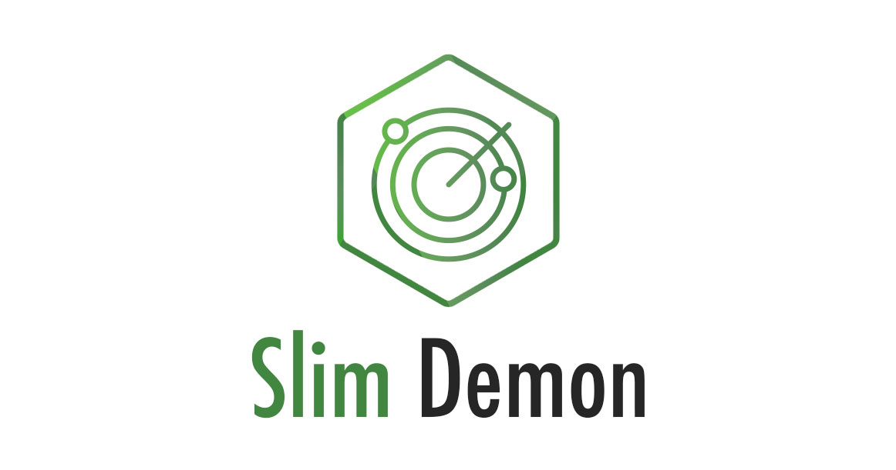

<p align="center">
  
</p>

<h1 align="center">Slim Demon</h1>

<p align="center">😈 Slim Demon is a micro library that detects changes in the files of your NodeJS application and restart it quickly and automatically.</p>

<p align="center">
  <a title="MIT License" href="LICENSE.md">
    
  </a>
  <a title="Twitter: JoseJ_PR" href="https://twitter.com/JoseJ_PR">
    
  </a>  
  <a title="Github: Sponsors" href="https://github.com/sponsors/JoseJPR">
    
  </a>
  <br />
  <br />
</p>

## 🔖 Description
Slim Demon is a micro library based on the native NodeJS API using the core and the native libraries.

You can define a directory and one or more types of files that will be listened to, if any of these files change the application will be restarted quickly and automatically.

## 📐 How to work with this project

### 1️⃣ Install this module into your project.

```bash
npm i slim-demon --save-dev
```

### 2️⃣ Configure the demon

Include the demon configuration in your main package.json file.

Property | Type | Description
-------- | ---- | -------
rootDirectory | string | The main folder of your NodeJS Application.
extensionsFile | Array<string> | File extensions to review.
mainApplication | string |Command to execute when a change is detected in the files.

#### Example

```json
"demon": {
  "rootDirectory": "./src",
  "extensionsFile": [
    "js"
  ],
  "mainApplication": "npm run start"
}
```

### 3️⃣ Add a custom script

Include the following sentence into your scripts of your packate.json file:

```json
"scripts": {
  "start:watch": "node node_modules/slim-demon"
}
```

### 4️⃣ Run

Run this command in your terminal.

```bash
$npm run start:watch
```

## 📂 Code Scaffolding

```any
/
├── assets 🌈                   # Images Sources.
├── doc                         # QAC Documentation.
├── example                     # Local example.
├── src 📦                      # Main file library.
└── ...
```

## ⛽️ Review and Update Sependencies

For review and update all npm dependencies of this project you need install in global npm package "npm-check-updates" npm module.

```bash
# Install and Run
$npm i -g npm-check-updates
$ncu
```

## License

[MIT](LICENSE.md)

## Happy Code

Created with JavaScript, lot of ❤️ and a few ☕️

## This README.md file has been written keeping in mind

[GitHub Markdown](https://guides.github.com/features/mastering-markdown/) \
[Emoji Cheat Sheet](https://www.webfx.com/tools/emoji-cheat-sheet/)
